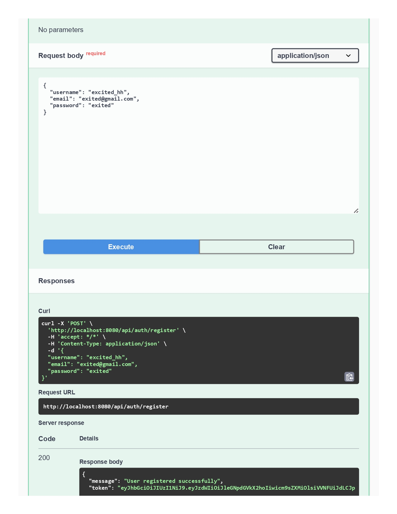
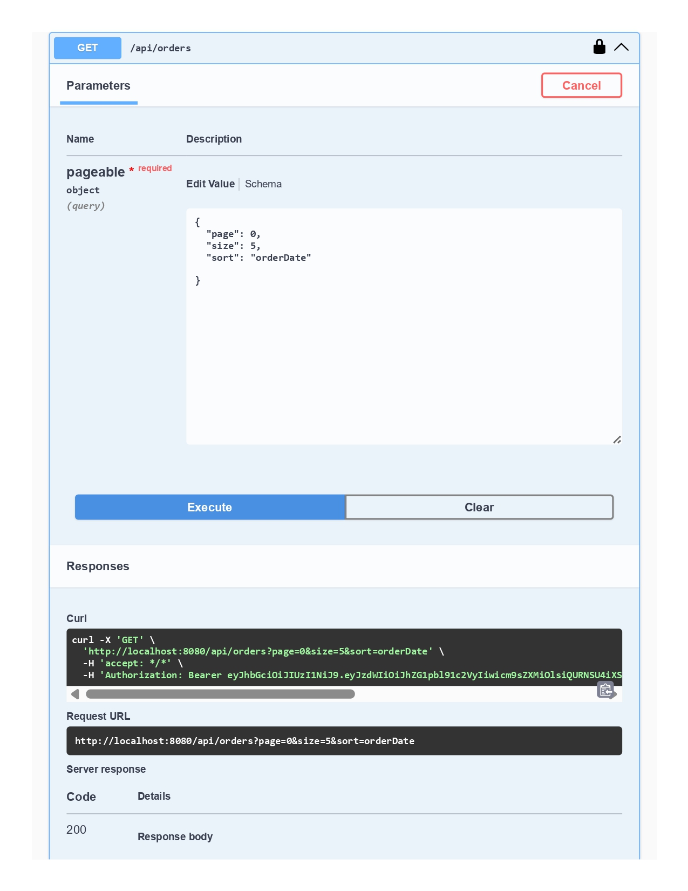

# 🛒 E-Commerce Backend API

A production-ready backend built with **Spring Boot** and **PostgreSQL**.  
Implements authentication, authorization, product management, shopping cart, order processing, and more.

---

## ⚙️ Features & Concepts

| Feature                         | Technology / Concept                            |
|--------------------------------|--------------------------------------------------|
| **Product Catalog**             | Basic entity with CRUD                           |
| **User Registration/Login**     | Spring Security + JWT                            |
| **Role-based Access**            | Admin vs User, `@PreAuthorize` annotations       |
| **Cart & Orders**                 | `@OneToMany`, `@ManyToOne` relationships          |
| **Checkout & Order History**       | Transactional logic                            |
| **Search & Filter Products**        | Dynamic queries / QueryDSL                     |
| **Pagination & Sorting**              | `Pageable` + `@PageableDefault`                |
| **Global Exception Handling**            | `@ControllerAdvice`                        |
| **DTOs + MapStruct**                          | Maintain clean code separation         |
| **Validation**                                     | `@Valid` and custom validators          |
| **PostgreSQL**                                         | Production-ready database            |
| **Swagger Documentation**                                   | API testing and documentation UI      |
| **Unit + Integration Tests**                                          | JUnit + Mockito + TestContainers   |
| **Docker**                                                                     | Containerized deployment      |

---

📦 Dependencies

Spring Web

Spring Security

Spring Data JPA

Spring Validation

PostgreSQL JDBC Driver

MapStruct

Lombok

Spring Boot DevTools / Spring Boot Starter Test / JUnit

---

## 🧪 Swagger UI

Once the application is running locally, open:

```

[http://localhost:8080/swagger-ui/index.html](http://localhost:8080/swagger-ui/index.html)

```

to explore and test all available API endpoints.

---

## 📸 API Walkthrough

### 🔹 Swagger UI Overview
| | | | |
| :---: | :---: | :---: | :---: |
|  |  |  |  |

---

### 🔹 User Registration & Login
| Registration |  | Login |  |
| :---: | :---: | :---: | :---: |
|  |  |  |  |

---

### 🔹 Admin Login & Product Management
| Admin Login |  | Product by ID (JWT protected) |  |
| :---: | :---: | :---: | :---: |
|  |  |  |  |

---

### 🔹 Cart & Orders
| Add Product to Cart | | Post Order | |
| :---: | :---: | :---: | :---: |
|  |  |  |  |

---

### 🔹 Order History
| | | |
| :---: | :---: | :---: |
|  |  |  |

---

## ✉️ Author

**Adem Hamizi**  
Email: adem.hamizi@lau.edu  
Phone: +213 796550612  
GitHub: [itadoridesu](https://github.com/itadoridesu)